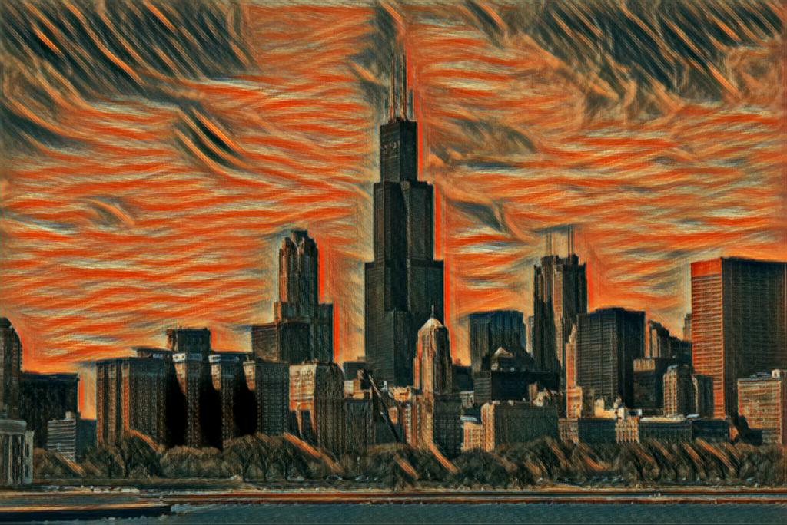
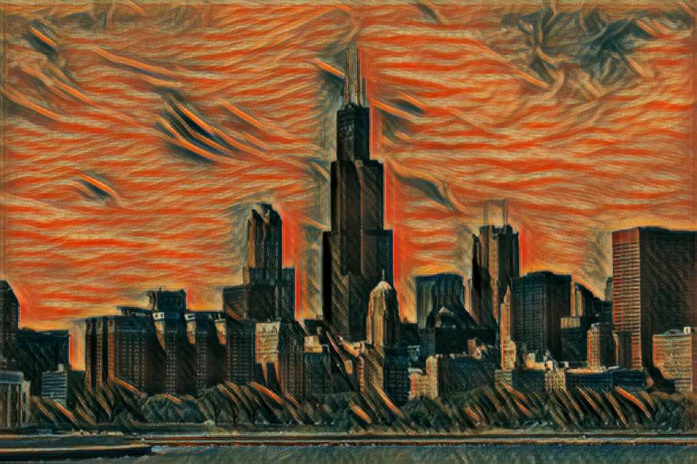
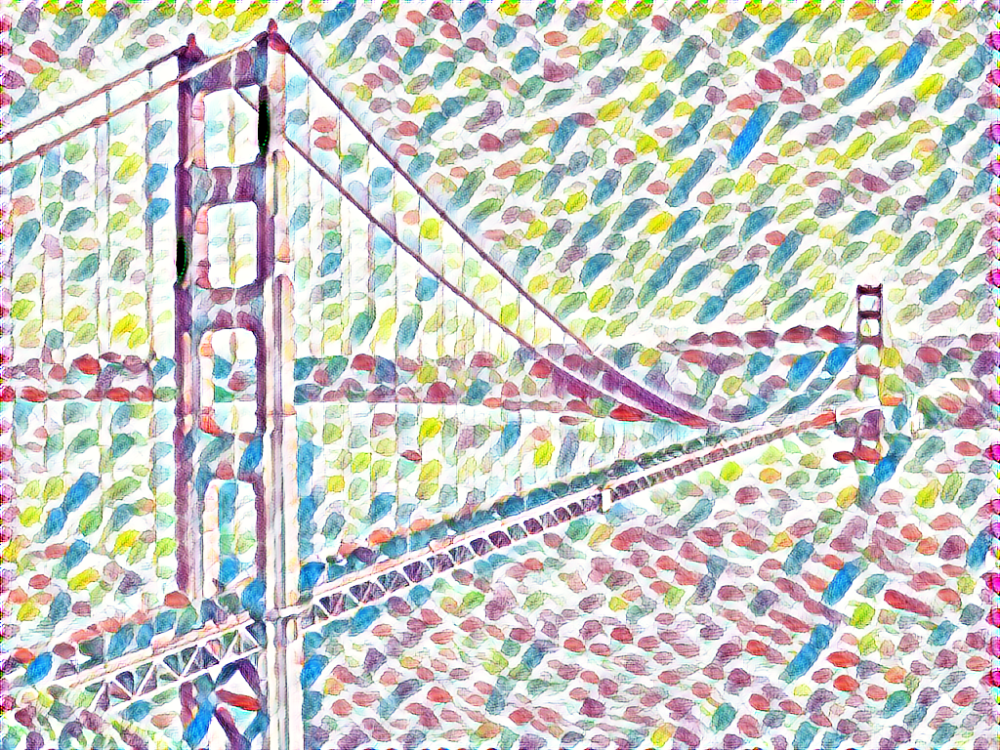
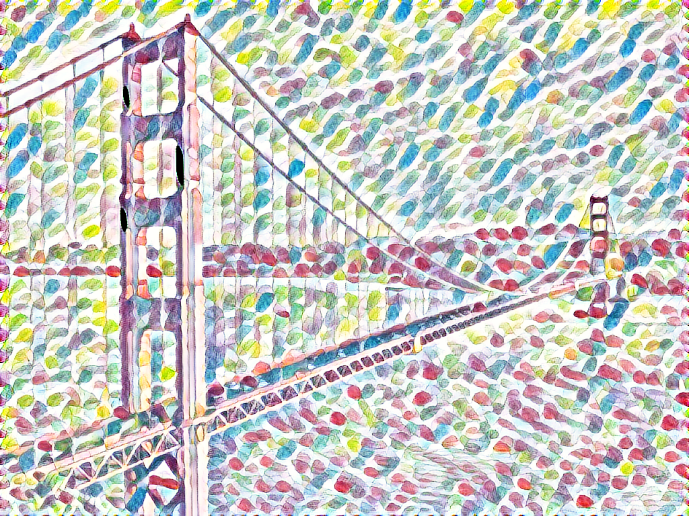
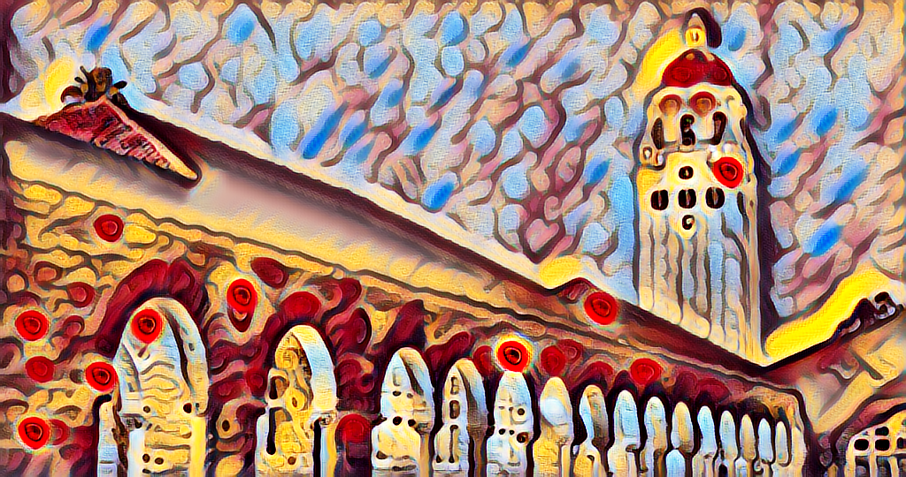
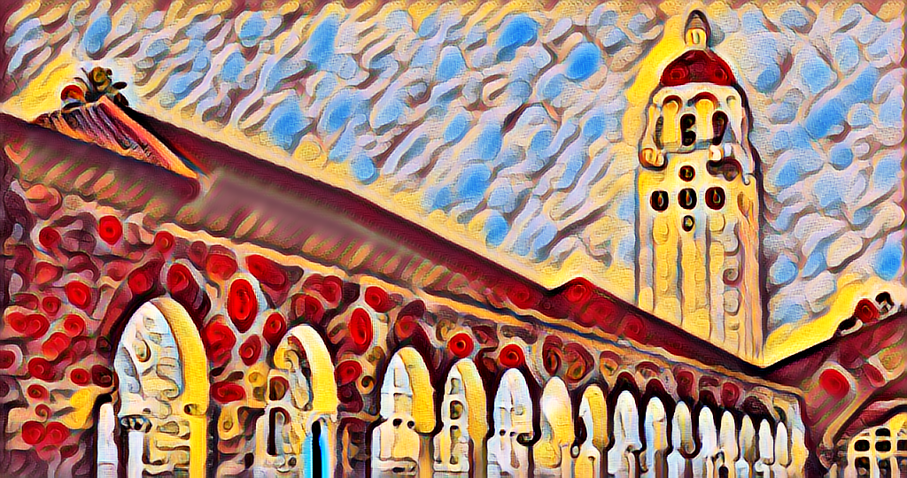
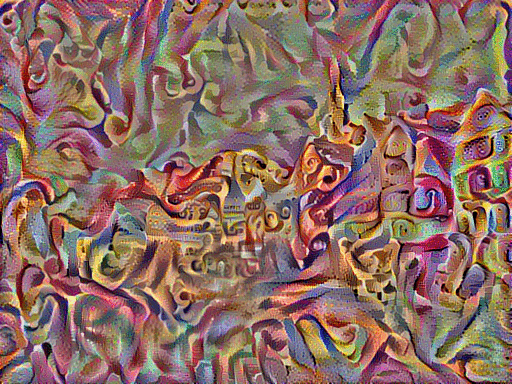
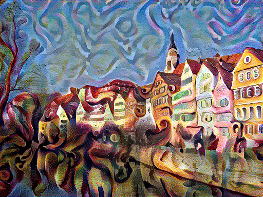

# neural-style-keras
Implementation of neural style transfer methods using Keras and Tensorflow. This includes the iterative stylization from [1], the fast style transfer from [2] and the multi-style nets from [3]. All models include instance normalization [4].

## Fast style transfer
To use a pre-tained net simply use the script

```bash
python fast_stye_transfer.py --checkpoint_path data/models/candy.h5 --input_path content_imgs\
--output_path pastiche_output --use_style_name
```

All the images in the `input_path` will be stylized and the resulting images will be saved on the `output_path`. If the network was trained on multiple styles, all styles will be applied.

## Training a pastiche network
#### Set up coco
You may download [the coco dataset](http://mscoco.org/home/) [5] with the provided script (it may take a while)
```bash
cd data; sh download_coco.sh
```
Afterwards, preprocess it into an hdf5 file
```bash
python make_style_dataset.py
```
#### Make the gram dataset
You should then make the gram dataset, this will pre-compute the gram matrices for the styles the net will be trained on. At this stage you should input the size of each image for the computation of the gram matrices. For more information on the usage see [this section](#make_gram_dataset). Below is an example:
```bash
python make_gram_dataset.py --gram_dataset_path candy_grams.h5 --style_dir style_imgs \
--style_imgs candy.jpg --style_img_size 384 --gpu 0
```
#### Train the network
You may then train the network with the `train.py` script. For more usage information see [this section](#train). Below is an example:
```bash
python train.py --content_weight 1 --style_weight 10 --tv_weight 1e-4 --norm_by_channels \
--gram_dataset_path candy_grams.h5 --checkpoint_path candy.h5
```

### Stylized images
Below are some examples of images stylized by trained networks. Each row contains, respectively, the style image, the content image and images stylized by a single style net and by a 6-style net. All images on the fourth column were stylized by the same network.

<div align='center'>
  
  
  
  
</div>
<div align='center'>
  
  
  
  
</div>
<div align='center'>
  
  
  
  
</div>

## Script usage
### make_gram_dataset
This script pre-computes the gram matrices of the style images and stores them in an hdf5 file. All gram matrices are computed without channel normalization and will be normalized before training if necessary. The options are:
* `--style_dir [gram_imgs]`: directory that contains the style images.
* `--gram_dataset_path [grams.h5]`: where to save the output file.
* `--style_imgs [None]`: image file names that will be used, can be a list. If `None`, all images in the directory will be used.
* `--style_img_size [None]`: largest size of the image, can be a single size that will be applied to all images or a list with a size for each image. If `None`, the image will not be resized.
* `--gpu`: which gpu to run the code on. If `-1`, the code will run on cpu.
* `--allow_growth`: flag that stops tensorflow from allocating all gpu memory at the start of the session.

### train
Script that trains the pastiche network. You should have preprocessed the coco dataset and a gram dataset before using it. Below are all the options:
* `--lr [0.01]`: learning rate that will be used on the adam optimizer to update the network weights.
* `--content_weight [1.]`: weight of the content loss. Can be a single value that will be used for all styles or a list with a different weight for each style.
* `--style_weight [1e-4]`: weight of the style loss. Can be a single value that will be used for all styles or a list with a different weight for each style. Do note that the default value is not reasonable if gram matrices are normalized by channels. If so, this should be around 10.
* `--tv_weight [1e-4]`: weight of the total variation loss. Variation loss can be used to improve the local coherence of the images.
* `--width_factor [2]`: how wide the convolutional layers are. This is a multiplicative factor. Use 2 for the original implementation on [2] and if reproducing [3]. Use 1 if reproducing results from [2] with instance normalization.
* `--nb_classes [1]`: the number of styles the network will learn.
* `--norm_by_channels`: flag that sets whether the gram matrices will be normalized by the number of channels. Use this to reproduce [2], do not use to reproduce [3].
* `--num_iterations [40000]`: how many iterations the model should be trained for.
* `--save_every [500]`: how often the model will be saved to the checkpoint.
* `--batch_size [4]`: batch size that will be used during training.
* `--coco_path [data/coco/ms-coco-256.h5]`: path to the coco dataset hdf5 file.
* `--gram_dataset_path [grams.h5]`: path to the gram dataset.
* `--checkpoint_path [checkpoint.h5]`: where to save the checkpoints. The checkpoint includes the network weights as well as the training args.
* `--gpu`: which gpu to run the code on. If `-1`, the code will run on cpu. It is not recommended to run this on cpu.
* `--allow_growth`: flag that stops tensorflow from allocating all gpu memory at the start of the session.


## Iterative style transfer
You can stylize the image by iteratively updating the input image so as to minimize loss.
```bash
python iterative_style_transfer.py \
--content_image_path content_imgs/tubingen.jpg \
--style_image_path style_imgs/starry_night.jpg \
--output_path starry_tubingen.png
```

The full set of options include:
* `--content_image_path`: path to the image that will be used as content.
* `--style_image_path`: path to the image that will be used as style.
* `--output_path`: where to save the output.
* `--lr [10.]`: changes the learning rate of the adam optimizer used to update the image.
* `--num_iterations [1000]`: number of iterations performed.
* `--content_weight [1.]`: weight of the content loss.
* `--style_weight [1e-4]`: weight of the style loss.
* `--tv_weight [1e-4]`: weight of the total variation loss.
* `--content_layers`: list of layers used on the content loss.
* `--style_layers`: list of layers used on the style loss.
* `--norm_by_channels`: whether the gram matrices will the normalized by the number of channels. Use this to compute gram matrices as in [2], do not use if to compute as in [3]. If using this, style_weight should be in the order of `10`.
* `--img_size [512]`: largest size of the generated image, the aspect ratio is determined by the content image used. The larger the size the longer it takes.
* `--style_img_size [None]`: largest size of the style image when computing the gram matrix. Changing this will change how the style is captured. If `None`, the original size is used.
* `--print_and_save [100]`: how many iterations for each print and save.
* `--init [random]`: type of initialization: `random` for noise initialization or `content` for initializing with the content image.
* `--std_init [0.001]`: standard deviation for the noise initialization.
* `--gpu`: which gpu to run it on. Use `-1` to run on cpu. It is very recommended to run this on a gpu.
* `--allow_growth`: flag that stops tensorflow from allocating all gpu memory at the start of the session.

#### Examples
**Initializing with noise**

```bash
python iterative_style_transfer.py \
--content_image_path content_imgs/tubingen.jpg \
--style_image_path style_imgs/candy.jpg \
--output_path candy_tubingen.png \
--content_weight 5 --style_weight 30 \
--tv_weight 1e-3 --norm_by_channels \
--style_img_size 384 --gpu 0
```

<div align=center>
  
</div>

**Initializing with content**

```bash
python iterative_style_transfer.py \
--content_image_path content_imgs/tubingen.jpg \
--style_image_path style_imgs/candy.jpg \
--output_path candy_tubingen_content.png \
--content_weight 5 --style_weight 100 \
--norm_by_channels --style_img_size 384 \
--gpu 0 --init content
```

<div align=center>
  
</div>

## Requirements
* keras
* tensorflow
* h5py
* pyyaml

## References
* [1]: L. A. Gatys, A. S. Ecker and M. Bethge. "A Neural Algorithm for Artistic Style". [Arxiv](https://arxiv.org/abs/1508.06576).
* [2]: J. Johnson, A. Alahi and L. Fei-Fei. "Perceptual Losses for Real-Time Style Transfer and Super-Resolution". [Paper](http://cs.stanford.edu/people/jcjohns/papers/eccv16/JohnsonECCV16.pdf) [Github](https://github.com/jcjohnson/fast-neural-style)
* [3]: V. Dumoulin, J. Shlens and M. Kudlur. "A Learned Representation for Artistic Style". [Arxiv](https://arxiv.org/abs/1610.07629) [Github](https://github.com/tensorflow/magenta/tree/master/magenta/models/image_stylization)
* [4]: D. Ulyanov, A. Vedaldi and V. Lempitsky. "Instance Normalization: The Missing Ingredient for Fast Stylization". [Arxiv](https://arxiv.org/abs/1607.08022)
* [5]: T. Lin et al. "Microsoft COCO: Common Objects in Context". [Arxiv](https://arxiv.org/abs/1405.0312) [Website](http://mscoco.org/home/)
